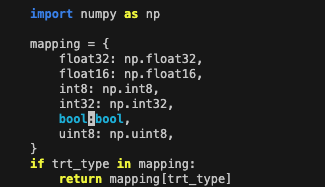

## README for TensorRT 8.5.x / Jetpack 5.1.2 / Jetson Orin Nano (8GB Unified Memory)

### step by step
### 1. build docker image
- docker build -t ur-image:v1 .

### 2. run dokcer container
- sudo docker run -it --rm --net=host --runtime nvidia -e DISPLAY=$DISPLAY -v /tmp/.X11-unix/:/tmp/.X11-unix \
-v ~/work:/workspace ur-image:v1

### 3. convert pt to onnx
- `$ python3 onnx_convert.py`

### 4. convert onnx to engine
- `trtexec --onnx=model.onnx --saveEngine=model.engine --minShapes=input:1x3x64x64 --optShapes=input:1x3x256x256 --maxShapes=input:1x3x512x512 --fp16`

### 5. numpy upgrade
- `$ pip install --upgrade numpy`

### 6. modify tensorRT __init__.py
-  &nbsp; 

### 7. inference
- `$ python3 engine_test.py`

### 8. result
-  &nbsp;
 
-  &nbsp;
-  &nbsp;
